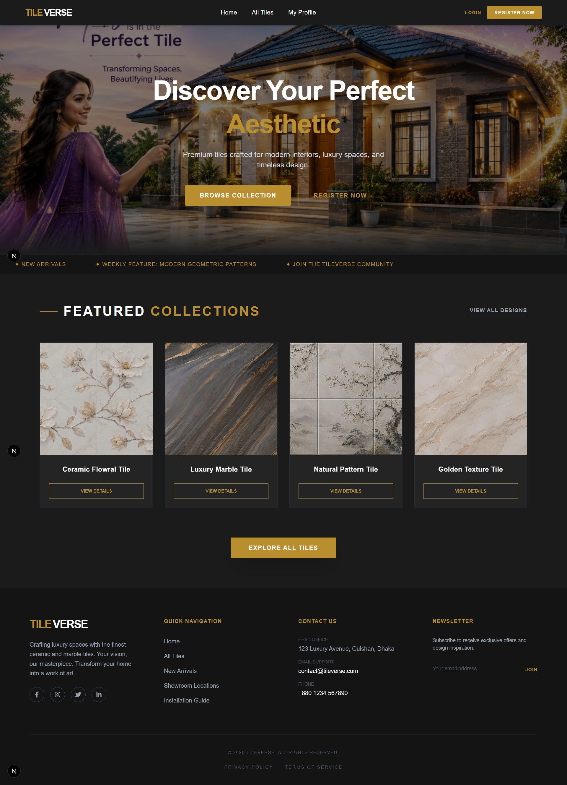
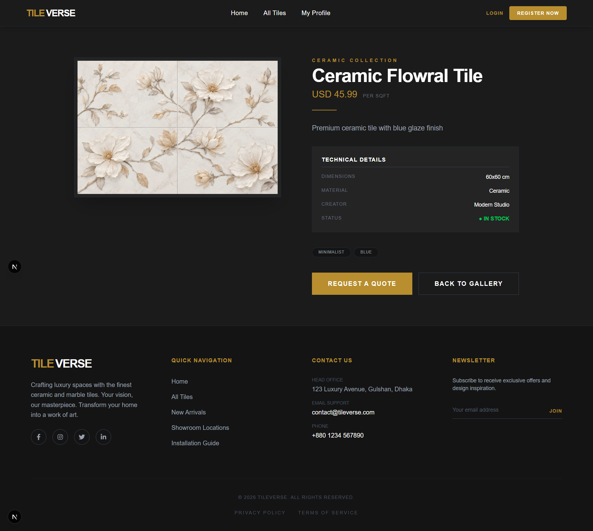

# 🧱 TileVerse

TileVerse is a modern and responsive tile gallery web application built with Next.js.  
Users can explore premium tile collections, search tiles, view detailed information, authenticate securely, and manage their profile.

---

## 🌐 Live Website

👉 https://tiles-gallery-ten-orpin.vercel.app

---

## 📌 Project Purpose

The purpose of this project is to create a visually elegant tile gallery platform where users can browse aesthetic tile collections and explore detailed design information in a smooth and responsive user experience.

---

## 🚀 Key Features

- 🔐 Authentication system using BetterAuth
- 🔑 Google Login support
- 👤 User profile management
- ✏️ Update profile information (name & image)
- 🔒 Private route protection
- 🧱 Dynamic tile details page
- 🔍 Search functionality for tiles
- 📱 Fully responsive design (mobile/tablet/desktop)
- 🎨 Modern UI design with Tailwind + DaisyUI
- ⚡ Fast performance with Next.js App Router
- 🚫 Custom 404 Not Found page
- ⏳ Loading state implementation

---

## 🖼️ Screenshots

_Add screenshots here for better presentation_

```md



![loging-page] (login-page.png)

````

---

## 🛠️ Technologies Used

* Next.js (App Router)
* React
* Tailwind CSS
* DaisyUI
* BetterAuth
* MongoDB
* React Icons
* React Hot Toast

---

## 📦 NPM Packages Used

```bash
npm install better-auth
npm install mongodb
npm install react-icons
npm install react-hot-toast
npm install daisyui
```

---

## 🔑 Environment Variables

Create a `.env.local` file in the root directory and add:

```env
MONGODB_URI=your_mongodb_uri_here
BETTER_AUTH_SECRET=your_secret_key_here
BETTER_AUTH_URL=http://localhost:3000

GOOGLE_CLIENT_ID=your_google_client_id_here
GOOGLE_CLIENT_SECRET=your_google_client_secret_here
```

---

## 🧪 Run Locally

Clone the project:

```bash
git clone https://github.com/everluma/tileverse.git
```

Go to the project directory:

```bash
cd tileverse
```

Install dependencies:

```bash
npm install
```

Run the development server:

```bash
npm run dev
```

---

## 📂 Folder Structure

```bash
src/
 ├── app/
 ├── components/
 ├── data/
 ├── lib/
 └── styles/
```

---

## 👨‍💻 Author

Developed by **Farjana Aktar Monisha**

---

## ⚡ Notes

* Fully responsive design implemented
* Private routes protected using authentication
* Environment variables properly secured
* Ready for production deployment

````

